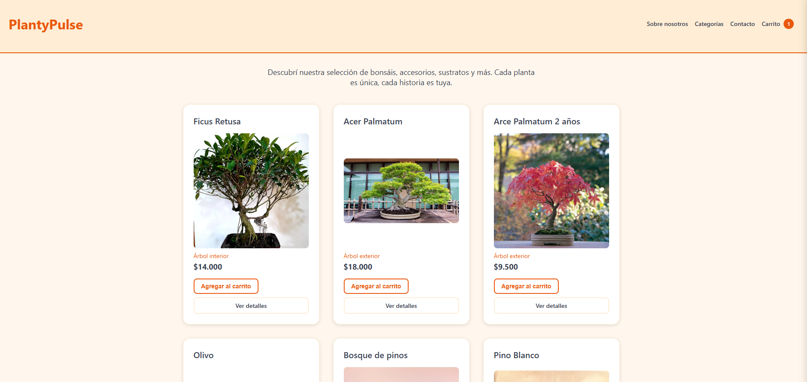
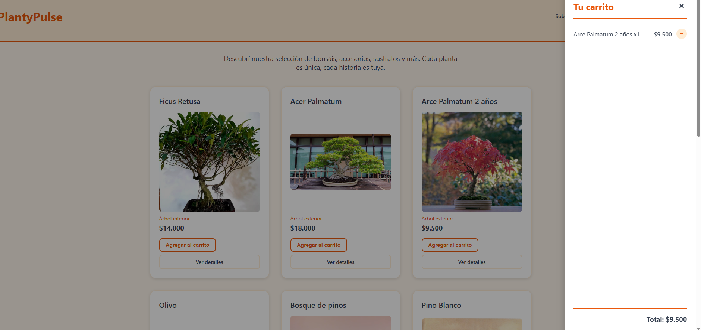
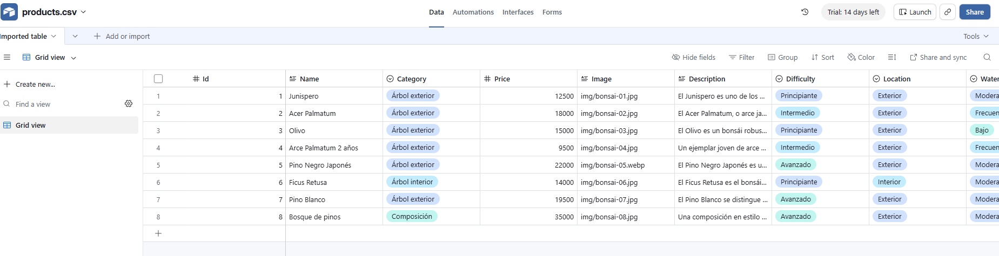

# PlantyPulse

**Aplicaciones Web Cliente #86795 — Javier Agustín Fernández**

Ecommerce de **bonsáis**: catálogo de productos con **carrito** y **favoritos**.

## ¿Qué hace?

- **Catálogo** de bonsáis renderizado dinámicamente con JavaScript.
- **Carrito** de compras con panel lateral, persistente entre recargas.
- **Favoritos** (❤️) con su propio panel lateral, también persistente.
- **Detalle** de cada producto en su propia página.

El carrito y los favoritos se guardan en `localStorage`, así que sobreviven al recargar la página.

## Datos con Airtable

Los productos **no** están hardcodeados: se traen desde una base de **Airtable** con `fetch`.

- Airtable funciona como base de datos sin backend propio.
- La app pide los productos vía su API REST y los muestra en el catálogo.
- Las credenciales viven en `js/config.js` (gitignoreado); en el deploy se generan desde GitHub Secrets.

## Stack

HTML + CSS + JavaScript. Datos en Airtable. Deploy en GitHub Pages.
